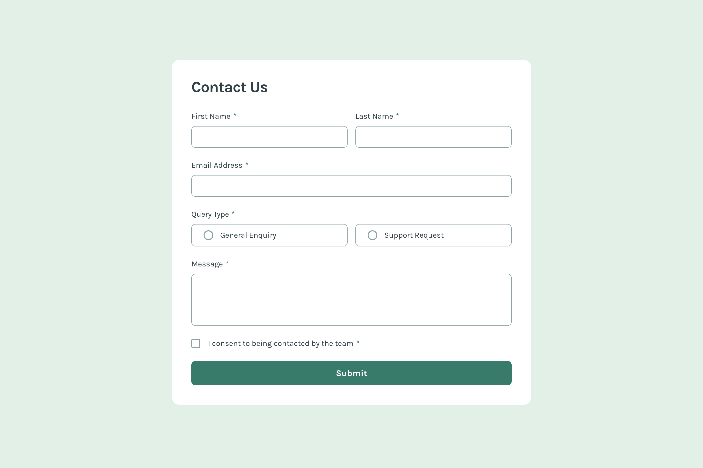

# Contact form

This is a solution to the [Contact form challenge on Frontend Mentor](https://www.frontendmentor.io/challenges/contact-form--G-hYlqKJj).

## Table of contents

- [Overview](#overview)
  - [The challenge](#the-challenge)
  - [Screenshot](#screenshot)
  - [Links](#links)
- [My process](#my-process)
  - [Built with](#built-with)
  - [What I learned](#what-i-learned)
  - [Continued development](#continued-development)

## Overview

### The challenge

Users should be able to:

- Complete the form and see a success toast message upon successful submission
- Receive form validation messages if:
  - A required field has been missed
  - The email address is not formatted correctly
- Complete the form only using their keyboard
- Have inputs, error messages, and the success message announced on their screen reader
- View the optimal layout for the interface depending on their device's screen size
- See hover and focus states for all interactive elements on the page

### Screenshot



### Links

- Solution URL: [https://github.com/jaylspace/contact-form](https://github.com/jaylspace/contact-form)
- Live Site URL: [https://contact-form-jayl.vercel.app](https://contact-form-jayl.vercel.app)

## My process

### Built with

- Semantic HTML5 markup
- CSS custom properties
- Flexbox
- CSS Grid
- vanilla JavsScript

### What I learned

Since I was not that familiar with `radio` and `checkbox` input types, it was a great opportunity to try out and apply custom CSS styles and manipulate them with JavaScript. Normally, I would have made my own custom button and act like if it's one of them. Glad I didn't stick to my old and own habbit and tried out pre-existing input types.

This is how I applied custom styles:

```css
input[type='checkbox'] {
  width: 1.125rem;
  height: 1.125rem;
  position: relative;
  appearance: none;
  border-radius: 2px;
  border: 2px solid var(--color-green-300);
}

input[type='checkbox']:checked {
  border: none;
}

input[type='checkbox']:checked::before {
  content: '';
  width: 100%;
  height: 100%;
  position: absolute;
  top: 0;
  left: 0;
  background-image: url('./assets/images/icon-checkbox-check.svg');
  background-size: cover;
}
```

The form validation itself was a bit of a work. Wasn't that difficult, but had to consider lots of situation and write them into code.

But the main thing that I was obsessed with was the `FormData()` contructor which is built in Web APIs. I recently learned about this API and this was the first time that I have implemented in my own code. I found it amazingly comfortable especially when working with text-based input data. Think I will use this every time when working with forms.

### Continued development

I want to try out more input types until I feel comfortable working with them. Styling and manipulating programmatically. And validating form data is also my priority since working with form requires a lot of skills.
